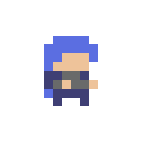
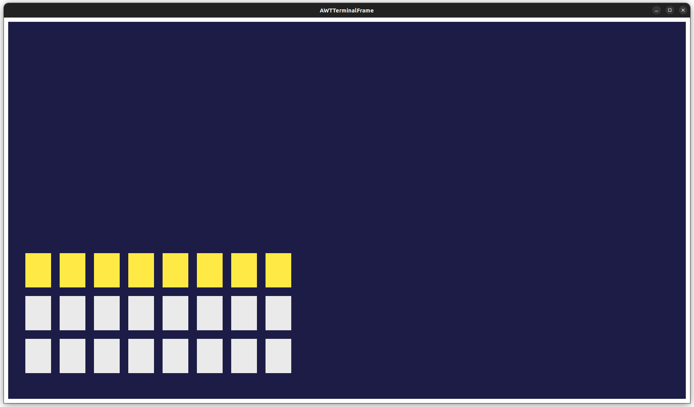
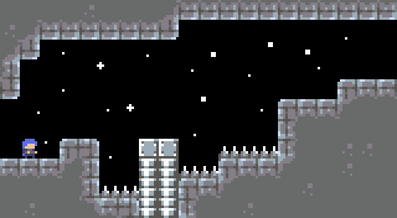
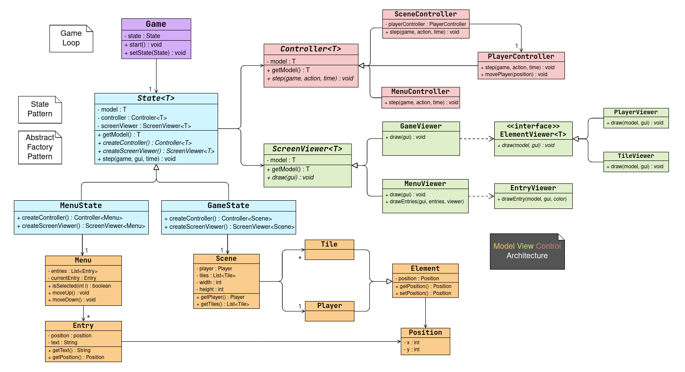

# LDTS_L01G07 - Timeless Odyssey

2D platformer game where the main character tries to explore a futuristic world full of obstacles. There are multiple consecutive "levels" that blend through progressive scenery changes.
>This project was developed by **Bruno Oliveira** (up202208700@fe.up.pt), **João Mendes** (up202208783@fe.up.pt) and **Rodrigo Coelho** (up202205188@fe.up.pt) for LDTS 2023/24.

### IMPLEMENTED FEATURES

- **Main Menu screen** - simple menu screen when launching the game, allowing for start, exit and a future settings option
- **Screen Resizer** - at the start of the game, the code reads the user's screen size and extends the game to that resolution
- **Basic Level Loader** - class to load levels of written text files with specific characters. This will be used to generate the different scenes/levels and allows for simple layout editions
- **Sprite Image Loader** - a class that loads PNG images into the game and can then represent them pixel by pixel. This will be used for the player, tiles and possibly other things in the program

### PLANNED FEATURES

- **Multiple Levels/Scenes** - consecutive scenes that will blend, similar to different levels but connected
- **Smoother Movement**    
    - **Better walking** - better walking movement with animation, walking at variable speeds
    - **Dashing** - ability to use a speed to the sides (and possibly other directions)
    - **Jump** - better jump control with variable heights, coyote time (jump timer at the end of platforms) and  ledge adjustments (allows jumping around a ledge when only a few pixels are left)
    - **Wall Crawl** - the ability to hang on and slowly fall from walls

### GAME SCREENSHOTS AND MOCKUPS

##### Initial main character design (Elene):

##### Initial Menu Design

##### Level Mockup

### GENERAL STRUCTURE

