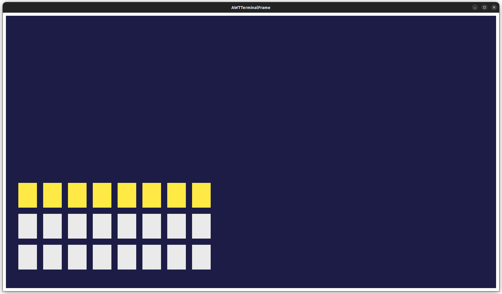

# LDTS_L01G07 - Timeless Odyssey

2D platformer game where the main character tries to explore a futuristic world full of obstacles. There are multiple consecutive "levels" that blend through progressive scenery changes.
>This project was developed by **Bruno Oliveira** (up202208700@fe.up.pt), **João Mendes** (up202208783@fe.up.pt) and **Rodrigo Coelho** (up202205188@fe.up.pt) for LDTS 2023/24.

### GAME SCREENSHOTS AND MOCKUPS

##### Initial Menu Design

##### Level Mockup

### GENERAL CODE STRUCTURE

