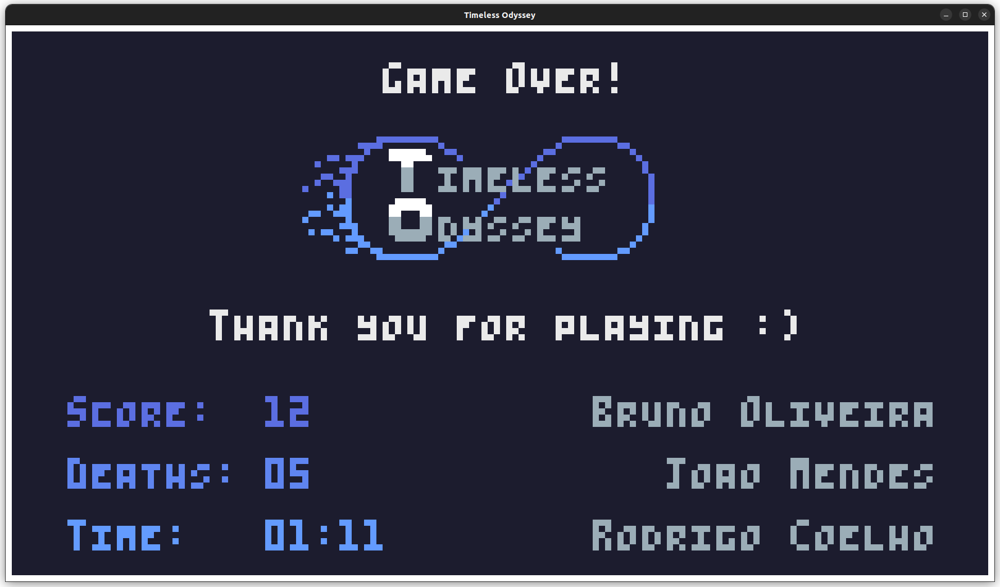
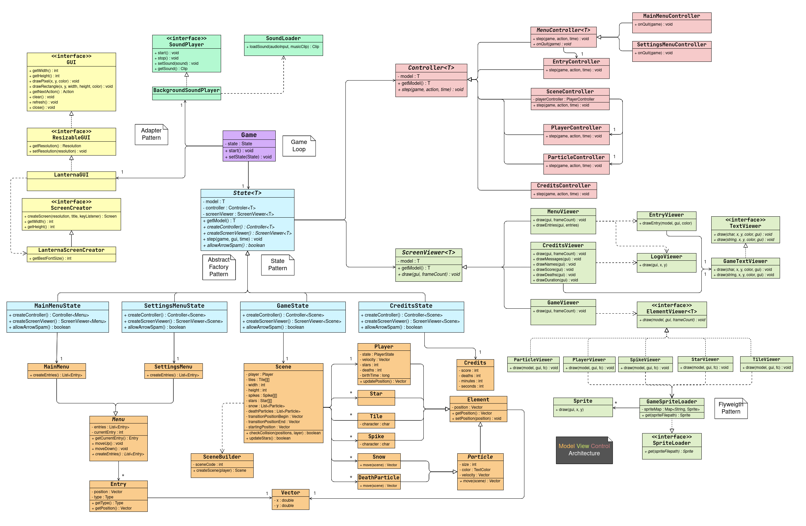

<h1 align="center">
  LDTS_L01G07 - Timeless Odyssey
</h1>

Timeless Odyssey is a 2D platformer game where the main character explores a futuristic world full of obstacles through the use of jumping and dashing mechanics, while also collecting stars to increase the score in search for a potential treasure. There are multiple consecutive "levels" with varying difficulty that blend through progressive scenery changes.

>

>This project was developed by <a href="https://github.com/Process-ing">Bruno Oliveira</a> (up202208700@fe.up.pt), <a href="https://github.com/The-Memechanic">João Mendes</a> (up202208783@fe.up.pt) and <a href="https://github.com/racoelhosilva">Rodrigo Coelho</a> (up202205188@fe.up.pt) for LDTS 2023/24
>

## IMPLEMENTED FEATURES

- **Main Menu Screen** - simple menu screen when launching the game, which allows the user to choose between starting the game, accessing the settings or exiting the application.
- **Screen Resizer** - at the start of the game, the code reads the user's screen size and extends the game to that resolution. The resolution can also be manually adjusted in the settings.
- **Level Loader** - class to load levels of written text files with specific characters, allowing to generate tiles and other elements for the different scenes/levels and allows for simple layout editions.
- **Sprite Image Loader** - a class that loads PNG images into the game and can then represent them pixel by pixel on the screen, using Lanterna. This is used for the player, tiles and spikes, stars and even logo images shown in the game.
- **Player Movement** - the player can move (using the arrow keys) at variable speeds, jump (Space bar) and even use a dash (X button) once to the side it's currently facing, gaining an impressive speed boost, but it can only successfully dash once before hitting the ground. Also, the player's movement animations change according to the player's current action and speed.
- **Collectible System** - throughout the levels, the player can find stars, which it should collect to get a better score at the end of the game.
- **Death Condition** - when the player touches one of the spikes, it dies and, after a short animation, returns to the beginning of the current level.
- **Particle System** - the particles give a nice aesthetic experience and flow to the gameplay. Currently, we have snow particles that appear in the foreground of all levels, as well as particles to animate the player's death.
- **Credits** - when finishing the game, the user is presented with an ending screen, where he can visualize the number of stars collected, the number of deaths and the total time of gameplay. Once done, the user can return to the main menu using the Escape button.

## GAME SCREENSHOTS AND MOCKUPS

[comment]: <> (Character Design)

<h4 align="center">
  Main Character Design
</h4>

[comment]: <> (Menu Design)

<h4 align="center">
  Menu Design
</h4>

  

[comment]: <> (Level Showcase)

<h4 align="center">
  Level and Gameplay Showcase
</h4>

  
  
  

[comment]: <> (Credits Screen)

<h4 align="center">
  Closing Credits
</h4>

  

[comment]: <> (General UML Structure)

## UML CLASS STRUCTURES AND OVERVIEW

  

## RESULTS

 - Intermediate delivery (10%): 20.0/20
 - Final Product (60%): 19.1/20
 - Final Report (30%): 20.0/20

 - Final Grade: 19.5/20