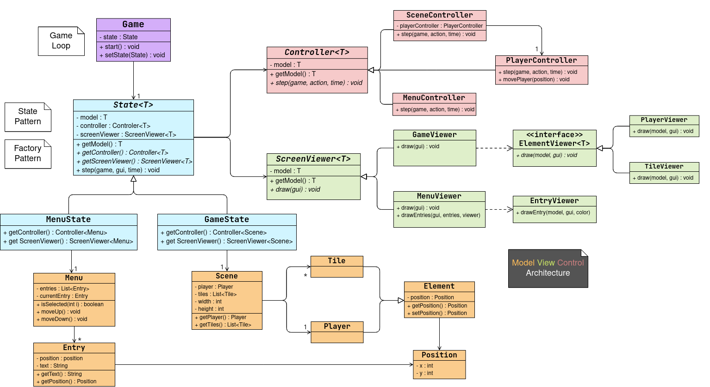
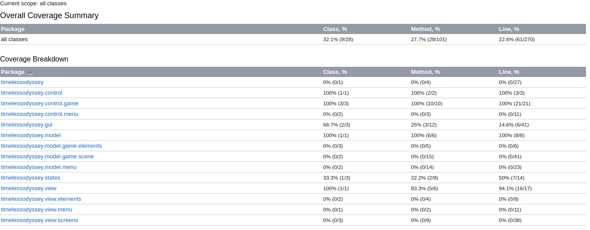

# LDTS_L01G07 - Timeless Odyssey

2D platformer game where the main character tries to explore a  futuristic world full of obstacles. There are multiple consecutive "levels" that blend through progressive scenery changes.

This project was developed by Bruno Oliveira (up202208700@fe.up.pt), João Mendes (up202208783@fe.up.pt) and Rodrigo Coelho (up202205188@fe.up.pt) for LDTS 2023/24.

## IMPLEMENTED FEATURES

- **Main Menu screen** - simple menu screen when launching the game, allowing for start, exit and a future settings option
- **Screen Resizer** - at the start of the game, the code reads the user's screen size and extends the game to that resolution
- **Basic Level Loader** - class to load levels of written text files with specific characters. This will be used to generate the different scenes/levels and allows for simple layout editions
- **Sprite Image Loader** - a class that loads PNG images into the game and can then represent them pixel by pixel. This will be used for the player, tiles and possibly other things in the program

## PLANNED FEATURES

- **Multiple Levels/Scenes** - consecutive scenes that will blend, similar to different levels but connected
- **Smoother Movement**    
    - **Better walking** - better walking movement with animation, walking at variable speeds
    - **Dashing** - ability to use a speed to the sides (and possibly other directions)
    - **Jump** - better jump control with variable heights, coyote time (jump timer at the end of platforms) and  ledge adjustments (allows jumping around a ledge when only a few pixels are left)
    - **Wall Crawl** - the ability to hang on and slowly fall from walls

## GENERAL STRUCTURE

## ARCHITECTURAL PATTERNS

### Model/View/Controller (MVC) Architecture

#### Problem in Context

When creating any piece of software that will have to deal with a user interface it's essential to provide an adequate structural pattern. The code needs to be well-organized and separated so that the Single Responsibility Principle isn't broken.  
Due to this, we must implement a way to deal separately with different components of our game (processing inputs, showing images to the screen, controlling the logic of the game...).

#### The Pattern

Due to this, we decided to use the Model/View/Controller Pattern which is very common in Graphical User Interfaces (GUI). The idea behind this pattern is to use three different sections:
- **Model** - used to represent the data, rules and game logic.
- **View**  - displays the model and sends actions to the controller.
- **Controller** - provides a model to view and interprets user actions.

Since we had chosen this pattern and had some ideas on how to implement it, each one of us started making the initial classes as methods for each one of the sections. After that, we just merged all the code, fixed some of the commits and had the main components of the game working.  
We have made some changes and tweaks after that initial plan, but since we applied the pattern the components are much more independent and can be altered without causing much conflict. This is useful when wanting to expand the game further.

#### Implementation

The implementation of this model can be seen by checking the folders inside the source code of our game (the links refer to the items regarding the main menu): 

- [Model](/src/main/java/timelessodyssey/model/menu/Menu.java)
- [View](/src/main/java/timelessodyssey/view/screens/MenuViewer.java)
- [Controller](/src/main/java/timelessodyssey/control/menu/MenuController.java)

An explanation is also provided in the following diagram:

#### Consequences

Just like we mentioned before, this architecture pattern allows for better code organization and segregation so that simple changes don't create much conflicts in other parts of the code.

## DESIGN PATTERNS

### Game Loop Pattern

#### Problem in Context

When designing a game we must have a way to update the state of every single entity over time. Initially, we may just want to keep the game running without needing the inputs, but as we develop the game further and add more entities we want to control how fast the game runs and how often we update the images shown to the screen.  
This is also important because code speed depends on the system of the user running the code. To make the game run at the same speed for all users, we must have a way to control this.

#### The Pattern

The design pattern frequently used to solve this issue is the Game Loop. A Game Loop is a while-loop that runs depending on the state of the game (for instance, it runs while it is not expected to exit the game).  
In pair with this loop, there is also a value of target FPS (frames per second) that represents the number of times the image should be updated to the screen during one second of execution.  
Knowing this value, we can also calculate the time the main execution thread should wait before continuing to the next iteration of the loop.  
This way, our game will run continuously and smoothly across users of different systems.

#### Implementation

The correspondent implementation of this pattern in our project can be found in the start method of our [main class and application entry point (Game)](/src/main/java/timelessodyssey/Game.java)

#### Consequences

Using the game loop pattern we have all the consequences that we mentioned before such as a smooth and similar gaming experience across a variety of user systems and the ability to easily control the speed of execution of our code.  
On the other hand, some linters may flag the command to make the main thread sleep as a bad practice since it is used inside a loop and relies on busy waiting. However, this is considered normal and is expected to happen when running a game.

### State Pattern

#### Problem in Context

The application should know if it's currently on the menu or running the game. This could be achieved by using a boolean field and conditional statements to change the application's behavior accordingly.  
However, not only would this approach be very hard to scale, but also adding more screens (for example, a settings screen) would mean changing all the previous logic, violating the Open/Closed Principle.  
Furthermore, it would also contribute to very ugly code inside some giant conditional statements, when the code tries to check what the current screen is to be able to do the appropriate operations, (this is a violation of the Single Responsibility Principle).

#### The Pattern

For this problem, we decided to use the **State** pattern. Through an abstract state class, this pattern lets us represent each of the application's state as its subclass.  
Each subclass implements the logic behind each state and it's responsible for the state transitions, based on the user's input.  
This way, it's easy to isolate each of the applications's screens and later add some more if we want to, contributing to more scalable code. The Game class only needs to execute the step function of the state it is currently in, not needing to know which state that is.

#### Implementation

On the source code, this pattern can be found mainly associated with the [Game](/src/main/java/timelessodyssey/Game.java) Class, but its implementation is on the whole states directory containing the [State](/src/main/java/timelessodyssey/states/State.java), [MenuState](/src/main/java/timelessodyssey/states/MenuState.java) and [GameState](/src/main/java/timelessodyssey/states/GameState.java) classes.

Here is also a diagram representation of the pattern:

#### Consequences

The use of the State Pattern contributes to the following benefits:

- The use of polymorphism removes the necessity of long conditional statements.
- It makes the code more modular, allowing for more ease of expansion, which will be useful if we want to add more states to the application.
- Each of the screens' behaviors becomes independent of each other, solving the violations of the Single Responsibility Principle and the Open/Closed Principle.

### Factory Pattern

#### Problem in Context

Just like we've seen on the previous topic, it is necessary to keep track of the state of the running game (which can be achieved using the State pattern). However, when designing a game, we usually want to have more than one state of execution (at least a main menu and a game would be convenient).

This way, we need a way to instantiate similar objects depending on the type of model associated with them. This can be achieved using the Factory Method.

#### The Pattern

The Factory Method consists of a Creator (abstract or not) which has multiple concrete Creators extending it. These creators will be the ones that contain the concrete products associated with them.

#### Implementation

In our specific case, this translates to having an [abstract State class](/src/main/java/timelessodyssey/states/State.java) using a generic model and different concrete classes ([MenuState](/src/main/java/timelessodyssey/states/MenuState.java) or [GameState](/src/main/java/timelessodyssey/states/MenuState.java)) that extend it and specify a model (Menu in the first case and Scene in the second).

Here is a diagram representation of the pattern:

#### Consequences

By using this pattern, we get rid of the need to treat the State logic with if-statements or switch-statements that filter the State by its type and use the power of polymorphism to control all of them using a single interface.  
We no longer have to deal with application-specific classes as they can be controlled using the same methods (as if they were just general "States").

### Adapter Pattern

#### Problem in Context

For the visuals of our game, we needed a way to draw characters to the terminal as pixels and receive some inputs, using Lanterna. Unfortunately, Lanterna's API does not provide some nice and clear functions that do this. We could hard-code those functionalities each time we try to execute these operations, which severely contributes to duplicate and nom-modular code.

#### The Pattern

We decided to use the pattern **Adapter** pattern. This pattern consists of creating a special object that converts the interface of an object so that another object can understand it. This way, each of our application's classes can use a more user-friendly interface (GUI) that still resorts to Lanterna's functionalities (through the adapter LanternaGUI).

#### Implementation  

The example implementation mentioned can be found in the following classes inside the GUI directory: the general [GUI class](/src/test/java/timelessodyssey/gui/GUI.java) and the specific [Lanterna class](/src/test/java/timelessodyssey/gui/LanternaGUI.java).  

A diagram depicting the idea behind this pattern can also be found here:

#### Consequences

The use of the Adapter Pattern allows our classes to not worry about the execution of certain operations with Lanterna, respecting the Single Responsibility Principle. It also increases the modularity of the code, allowing for easier changes down the line.

## KNOWN CODE SMELLS

Since we have been using Google's ErrorProne plugin and good code practices, we don't have any known code smells to note.  
Although we hope this continues, the number of code smells may change as we scrutinize our code further or as we keep implementing more features.

## TESTING

- [Unit Testing](/src/test/java/timelessodyssey/model/PositionTest.java) for the main section of our code (Model, View, Controller, States) 
- [Mocks](/src/test/java/timelessodyssey/states/StateTest.java) have been used in conjunction with Unit Tests
- [Coverage Testing](/docs/resources/testing/coverage.png) ≈ 23% (for now)  

  

#### Future Testing
      
  - Test the sections more extensively
  - Test the remaining sections of our code and their interactions    
  - Provide the mutation testing results

## SELF-EVALUATION

    - Bruno Oliveira: XX%
    - João Mendes: XX%
    - Rodrigo Coelho: XX%