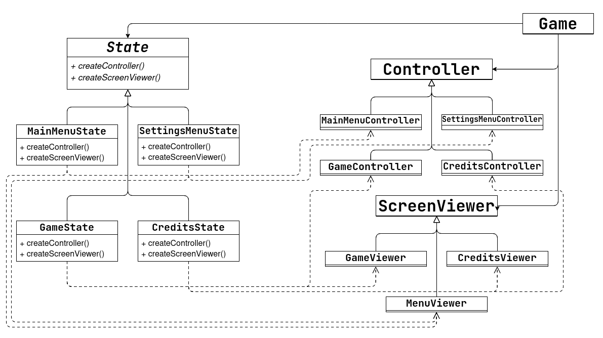
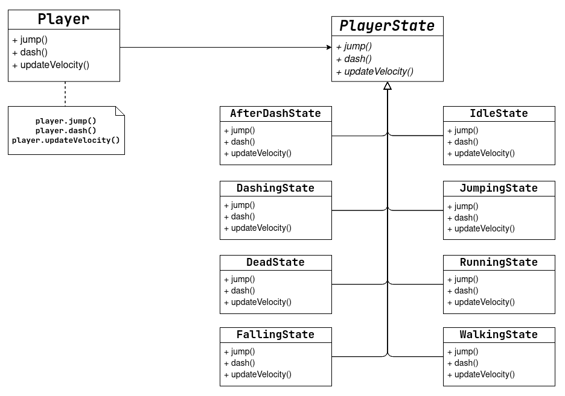
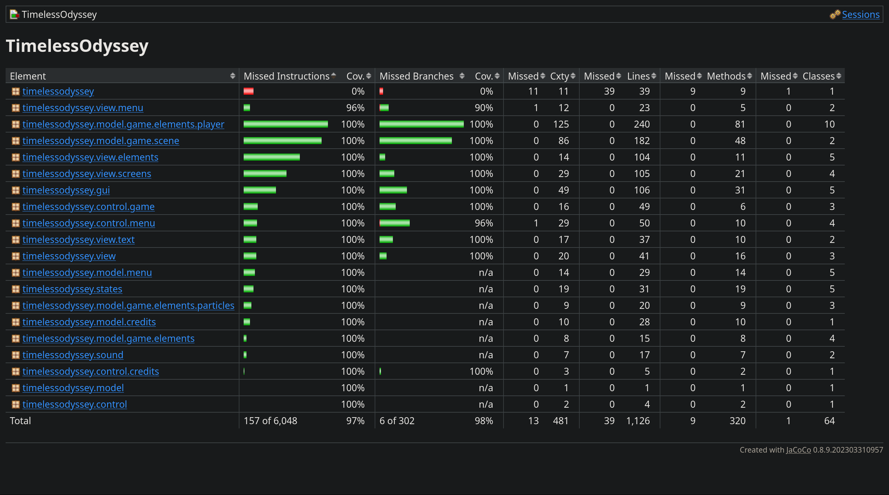

<h1 align="center">
  LDTS_L01G07 - Timeless Odyssey
</h1>

Timeless Odyssey is a 2D platformer game where the main character explores a futuristic world full of obstacles through the use of jumping and dashing mechanics, while also collecting stars to increase the score in search for a potential treasure. There are multiple consecutive "levels" with varying difficulty that blend through progressive scenery changes.

>

>This project was developed by Bruno Oliveira (up202208700@fe.up.pt), João Mendes (up202208783@fe.up.pt) and Rodrigo Coelho (up202205188@fe.up.pt) for LDTS 2023/24
>

## Table of Contents

- [Controls](#controls)
- [Implemented Features](#implemented-features)
- [Notes About Features](#notes-about-features)
- [General Structure](#general-structure)
- [Code Design](#design)
  - [Model-View-Controller](#code-structure)
  - [Game Loop](#game-loop)
  - [(Game) State Pattern](#multiple-game-states)
  - [Abstract Factory Pattern](#the-behavior-of-the-game-states)
  - [Adapter Pattern](#simplification-of-lanternas-interface)
  - [(Player) State Pattern](#player-states)
  - [Flyweight Pattern](#sprite-loading)
- [Code Smells](#known-code-smells)
- [Code Testing](#testing)

## CONTROLS

`>`: Moves the player to the right.

`<`: Moves the player to the left.

`SPACE`: Makes the player jump.

`X`: Makes the player dash.

`ESC`: Press ESC to quit or return to the main menu.

`ENTER`: Press ENTER to select the desired options in the menu.

## IMPLEMENTED FEATURES

- **Main Menu Screen** - simple menu screen when launching the game, which allows the user to choose between starting the game, accessing the settings or exiting the application.
- **Screen Resizer** - at the start of the game, the code reads the user's screen size and extends the game to that resolution. The resolution can also be manually adjusted in the settings.
- **Level Loader** - class to load levels of written text files with specific characters, allowing to generate tiles and other elements for the different scenes/levels and allows for simple layout editions.
- **Sprite Image Loader** - a class that loads PNG images into the game and can then represent them pixel by pixel on the screen, using Lanterna. This is used for the player, tiles and spikes, stars and even logo images shown in the game.
- **Player Movement** - the player can move (using the arrow keys) at variable speeds, jump (Space bar) and even use a dash (X button) once to the side it's currently facing, gaining an impressive speed boost, but it can only successfully dash once before hitting the ground. Also, the player's movement animations change according to the player's current action and speed.
- **Collectible System** - throughout the levels, the player can find stars, which it should collect to get a better score at the end of the game.
- **Death Condition** - when the player touches one of the spikes, it dies and, after a short animation, returns to the beginning of the current level.
- **Particle System** - the particles give a nice aesthetic experience and flow to the gameplay. Currently, we have snow particles that appear in the foreground of all levels, as well as particles to animate the player's death.
- **Credits** - when finishing the game, the user is presented with an ending screen, where he can visualize the number of stars collected, the number of deaths and the total time of gameplay. Once done, the user can return to the main menu using the Escape button.

## NOTES ABOUT FEATURES

Initially, we aimed to improve the player's movement even further with the addition of other mechanics and gimmicks to make the gameplay feel smoother, namely, variable height jumping, coyote time (ability to jump a few pixels after leaving the platform), ledge adjustments (jumping around ledge when only some adjustments are needed) and even wall crawling.  
However, as we progressed through the development of the game and as time passed, we ended up abandoning those ideas in favor of others. As a result, some of the initial "planned features" ended up being discarded and we have no plans of implementing them in the future as we're very satisfied with the result of our efforts.

## GENERAL STRUCTURE

  

## DESIGN

### Code Structure

#### Problem in Context

When creating any piece of software that will have to deal with a user interface it's essential to provide an adequate structural pattern. The code needs to be well-organized and separated so that the Single Responsibility Principle isn't broken.  
Due to this, we must implement a way to deal separately with different components of our game (processing inputs, showing images to the screen, controlling the logic of the game...).

#### The Pattern

Due to this, we decided to use the **Model/View/Controller** Pattern, which is very common in Graphical User Interfaces (GUI). The idea behind this pattern is to use three different sections:
- **Model** - used to represent the data, rules and game logic.
- **View**  - displays the model and sends actions to the controller.
- **Controller** - provides a model to view and interpret user actions.

Since we had chosen this pattern and had some ideas on how to implement it, each one of us started making the initial classes as methods for each one of the sections. After that, we just merged all the code, fixed some of the commits and had the main components of the game working.  
We have made some changes and tweaks after that initial plan, but since we applied the pattern the components are much more independent and can be altered without causing much conflict. This is useful when wanting to expand the game further.

#### Implementation

The implementation of this model can be seen by checking the folders inside the source code of our game (the links refer to the items regarding the main menu):

- [Model](/src/main/java/timelessodyssey/model/menu/MainMenu.java)
- [View](/src/main/java/timelessodyssey/view/screens/MenuViewer.java)
- [Controller](/src/main/java/timelessodyssey/control/menu/MainMenuController.java)

An explanation is also provided in the following diagram:

  

#### Consequences

Just like we mentioned before, this architecture pattern allows for better code organization and segregation so that simple changes don't create many conflicts in other parts of the code.

### Game Loop

#### Problem in Context

When designing a game we must have a way to update the state of every single entity over time. Initially, we may just want to keep the game running without needing the inputs, but as we develop the game further and add more entities, we want to control how fast the game runs and how often we update the images shown on screen.  
This is also important because code speed depends on the system of the user running the code. To make the game run at the same speed for all users, we must have a way to control this.

#### The Pattern

The design pattern frequently used to solve this issue is the **Game Loop**. A Game Loop is a while-loop that runs depending on the state of the game (for instance, it runs while it is not expected to exit the game).  
In pair with this loop, there is also a value of target FPS (frames per second) that represents the number of times the image should be updated to the screen during one second of execution.  
Knowing this value, we can also calculate the time the main execution thread should wait before continuing to the next iteration of the loop.  
This way, our game will run continuously and smoothly across users of different systems.

#### Implementation

The correspondent implementation of this pattern in our project can be found in the start method of our [main class and application entry point (Game)](/src/main/java/timelessodyssey/Game.java).

An explanation is also provided in the following diagram:

  

#### Consequences

Using the game loop pattern we have all the consequences that we mentioned before such as a smooth and similar gaming experience across a variety of user systems and the ability to easily control the speed of execution of our code.  
On the other hand, some linters may flag the command to make the main thread sleep as a bad practice since it is used inside a loop and relies on busy waiting. However, this is considered normal and is expected to happen when running a game.

### Multiple Game States

#### Problem in Context

The application should know if it's currently on the menu or running the game. This could be achieved by using a boolean field and conditional statements to change the application's behavior accordingly.  
However, not only would this approach be very hard to scale, but also adding more screens (for example, a settings screen) would mean changing all the previous logic, violating the Open/Closed Principle.  

Furthermore, it would also contribute to very ugly code inside some giant conditional statements, when the code tries to check what the current screen is to be able to do the appropriate operations (which is a violation of the Single Responsibility Principle).

#### The Pattern

For this problem, we decided to use the **State** pattern. Through an abstract state class, this pattern lets us represent each of the application's states as its subclass.  

Each subclass implements the logic behind each state and it's responsible for the state transitions, based on the user's input.  
This way, it's easy to isolate each of the applications's screens and later add some more if we want to, contributing to more scalable code. The Game class only needs to execute the step function of the state it is currently in, not needing to know which state that is.

#### Implementation

On the source code, this pattern can be found mainly associated with the [Game](/src/main/java/timelessodyssey/Game.java) Class, but its implementation is on the whole timelessodyssey.states package which contains the general [State](/src/main/java/timelessodyssey/states/State.java) as well as the  [MainMenuState](/src/main/java/timelessodyssey/states/MainMenuState.java), [SettingsMenuState](/src/main/java/timelessodyssey/states/SettingsMenuState.java),  [GameState](/src/main/java/timelessodyssey/states/GameState.java) and [CreditsState](/src/main/java/timelessodyssey/states/CreditsState.java) classes.

Here is also a diagram representation of the pattern:

  

As well as the state diagram depicting how the state transitions proceed during the game:

  

#### Consequences

The use of the State Pattern contributes to the following benefits:
- The use of polymorphism removes the necessity of long conditional statements.
- It makes the code more modular, allowing for more ease of expansion, which will be useful if we want to add more states to the application.
- Each of the screens' behaviors becomes independent of each other, solving the violations of the Single Responsibility Principle and the Open/Closed Principle.

### The Behavior of the Game States

#### Problem in Context

Just like we've seen on the previous topic, it is necessary to keep track of the state of the running game (which can be achieved using the State pattern). However, when designing a game, we usually want to have more than one state of execution (at least a main menu and a game would be convenient).

This way, we need a way to instantiate similar objects depending on the type of model associated with them. This can be achieved using an Abstract Factory.

#### The Pattern

The **Abstract Factory** allows creating families of related objects, without specifying what they are. It is up to each variant of the factory to specify (through method overriding) what the concrete objects will be.

#### Implementation

In our specific case, this translates to having an [abstract State class](/src/main/java/timelessodyssey/states/State.java) using a generic model and different concrete classes [MainMenuState](/src/main/java/timelessodyssey/states/MainMenuState.java), [SettingsMenuState](/src/main/java/timelessodyssey/states/SettingsMenuState.java),  [GameState](/src/main/java/timelessodyssey/states/GameState.java) and [CreditsState](/src/main/java/timelessodyssey/states/CreditsState.java) that extend it and specify a model ([MainMenu](/src/main/java/timelessodyssey/model/menu/MainMenu.java), [SettingsMenu](/src/main/java/timelessodyssey/model/menu/SettingsMenu.java), [Scene](/src/main/java/timelessodyssey/model/game/scene/Scene.java) and [Credits](/src/main/java/timelessodyssey/model/credits/Credits.java) respectively).

Here is a diagram representation of the pattern:

  

#### Consequences

By using this pattern, we get rid of the need to treat the State logic with if-statements or switch-statements that filter the State by its type and use the power of polymorphism to control all of them using a single interface.  
We no longer have to deal with application-specific classes as they can be controlled using the same methods (as if they were just general "States").

### Simplification of Lanterna's interface

#### Problem in Context

For the visuals of our game, we needed a way to draw characters to the terminal as pixels and receive some inputs, using Lanterna. Unfortunately, Lanterna's API does not provide some nice and clear functions that do this. We could hard-code those functionalities each time we try to execute these operations, which severely contributes to duplicate and non-modular code.

#### The Pattern

We decided to use the pattern **Adapter** pattern. This pattern consists of creating a special object that converts the interface of an object so that another object can understand it. This way, each of our application's classes can use a more user-friendly interface (GUI) that still resorts to Lanterna's functionalities (through the adapter LanternaGUI).

#### Implementation  

The example implementation mentioned can be found in the following classes inside the GUI directory: the general [GUI class](/src/main/java/timelessodyssey/gui/GUI.java) and the specific [Lanterna class](/src/main/java/timelessodyssey/gui/LanternaGUI.java).  

An explanation is also provided in the following diagram:

  

#### Consequences

The use of the Adapter Pattern allows our classes to not worry about the execution of certain operations with Lanterna, respecting the Single Responsibility Principle. It also increases the modularity of the code, allowing for easier changes down the line.

### Player States

#### Problem in Context

While implementing the player's movement, we wanted to restrict its movement while it's performing certain actions. For example, the player should not be able to jump right after jumping, it should not dash right after dashing, etc. Also, determining in what state the player is is useful for its respective animations.
Initially, we had the player's state stored in a lot of **flags** inside of the Player class, which not only was confusing to understand from those flags what exactly the player was doing but also made the code that updated the player's movement very long and messy. It also didn't favor the Open/Closed Principle very well, as we realized that slight alterations to one part of the movement impacted others in unpredictable ways.

#### The Pattern

For this problem, we recurred to the **State** Pattern once again. As stated before, this pattern suggests creating an abstract class for the player state and implementing each one of the concrete states as their own subclass, with their own implementation of the needed player's actions and state transitions.

#### Implementation

The implementation of this pattern can be found in the [abstract class PlayerState](/src/main/java/timelessodyssey/model/game/elements/player/PlayerState.java), as well as its subclasses: [IdleState](/src/main/java/timelessodyssey/model/game/elements/player/IdleState.java), [WalkingState](/src/main/java/timelessodyssey/model/game/elements/player/WalkingState.java), [RunningState](/src/main/java/timelessodyssey/model/game/elements/player/RunningState.java), [JumpingState](/src/main/java/timelessodyssey/model/game/elements/player/JumpingState.java), [FallingState](/src/main/java/timelessodyssey/model/game/elements/player/FallingState.java), [DashingState](/src/main/java/timelessodyssey/model/game/elements/player/DashingState.java), [AfterDashState](/src/main/java/timelessodyssey/model/game/elements/player/AfterDashState.java) and [DeadState](/src/main/java/timelessodyssey/model/game/elements/player/DeadState.java). 

This way, the player redirects the logic of movement to the state, and the state deals with the movement's actualization, with methods such as `movePlayerLeft()`, `jump()` or `updateVelocity()`.

A UML diagram describing the pattern implementation can be found below:

  

A state diagram highlighting how the state transitions proceed during gameplay can also be found here:

  

#### Consequences

With this pattern, all the phases of the player's movement became well segregated and intuitively identified, as well as more securely defined than with the flag fields. Also, the transitions between each state become much clearer and, if we were to add more states in the future, it would be as easy as adding another subclass (no need to potentially alter the behavior of other states to add another). It also allows for more flexible player movement, by allowing to make state-specific operations.

### Sprite Loading

#### Problem in Context

Each Sprite object holds a bitmap image. Although the images used throughout the game are very light, using a sprite for each element, like the tiles, can lead to unnecessary memory overhead.
The unification of the access to sprite objects would also be beneficial for mocking in unit testing.

#### The Pattern

For this problem, we used the **Flyweight** Pattern. This pattern lets us use more objects with the available amount of RAM by sharing parts of an object between multiple objects instead of having them keep the same data.

#### Implementation

The implementation of this pattern can be seen in the [SpriteLoader class](/src/main/java/timelessodyssey/view/SpriteLoader.java), as well as [LogoViewer](/src/main/java/timelessodyssey/view/menu/LogoViewer.java) and all subclasses of [ElementViewer](/src/main/java/timelessodyssey/view/elements/ElementViewer.java). The SpriteLoader has a map with all the [Sprite](/src/main/java/timelessodyssey/view/Sprite.java) objects needed by the application, and each viewer can access the wanted sprite using the sprite's filepath. 

A UML diagram with the structure of the implementation can be found here:

  

#### Consequences

This pattern allowed us to save some memory space and uniformize the sprite loading throughout the application, as well as facilitate unit testing, since the SpriteLoader can be used as a conduit for dependency injection.

## KNOWN CODE SMELLS

### Switch Statements

As of now, the menu entries ([Entry](/src/main/java/timelessodyssey/model/menu/Entry.java)) are each one of many entry types, defined in a enum, which the [EntryViewer](/src/main/java/timelessodyssey/view/menu/EntryViewer.java) and the [EntryController](/src/main/java/timelessodyssey/control/menu/EntryController.java) check to determine their visualization and behavior, respectively, through somewhat long **switch statements**. We tried to solve this problem with a **Command** Pattern, where each type of entry would implement how it should be visualized and how it would react. However, because the entry types are stored in the Model, this would violate the **Model-View-Controller** Pattern, so the switch statements were our best option.

We also used switch statements for handling the commands/inputs in our Controller, however each case did only basic calls, so it was not that big of an issue.

### Refused bequest

In our player states, some states (especially [DeadState](/src/main/java/timelessodyssey/model/game/elements/player/DeadState.java)) do not exactly implement the movement functions requested by the base class ([PlayerState](/src/main/java/timelessodyssey/model/game/elements/player/PlayerState.java)). For example, [JumpingState](/src/main/java/timelessodyssey/model/game/elements/player/JumpingState.java) does not alter the player movement with the `jump()` method, as the player should not jump right after the jump.  
This can be seen as a violation of the **Liskov Substitution Principle**, as the player cannot jump after already jumping once. However, the way we think the methods should be seen is how the player's movement should be updated after the user tries to do certain actions (in this case, if the player is not on the ground, all jumping tries should fail).  
One possible way to fix this would be by getting rid of the **State** Pattern applied, but we would end up with all the problems [mentioned before](#player-states), so we thought this would be the better choice.

### Duplicate code

In the player's states, the code for the state transitions (in the `getNextState()` method) looks very similar for most of the states. We tried to extract the identical code to methods as much as possible, but extracting more would lead to less legible and intuitive code. We could fix by creating additional base state classes which implement some of the methods, but this would not exactly solve the problem, as each state transition function is different from the other, and it would clutter the State Pattern implementation. 

### Data class

Outside of some minor functions of the model, like the [Vector](/src/main/java/timelessodyssey/model/Vector.java) class, we created the class [ViewerProvider](/src/main/java/timelessodyssey/view/ViewerProvider.java) to ease mocking the Viewer classes in our unit testing, while avoiding the Long Parameter List code smell int respective constructors. However, the ViewerProvider does not use any of its fields, only providing them to the other classes.

## TESTING

- **[Unit Testing](/src/test/java/timelessodyssey/model/game/scene/SceneTest.java)** for the testable sections of our code (Model, View, Controller, States, GUI, Sound) 
- **[Mocks](/src/test/java/timelessodyssey/states/MainMenuStateTest.java)** have been used in conjunction with Unit Tests
- **[Coverage Testing](/docs/resources/tests/coverage.png)** using JaCoCo 
  - Instruction Coverage ≈ 97%
  - Branch Coverage ≈ 98%
  

    
  

- **[Mutation Testing](/docs/resources/tests/mutation.png)** using Pitest
  - Line Coverage ≈ 97%
  - Mutation Coverage ≈ 80%
  - Test Strength ≈ 82%
  

    
  

Note: we couldn't achieve more instruction and branch coverage using JaCoCo because our switch-statements based on enums don't have a default option. Due to this, JaCoCo considers that some branches or instructions are not tested, therefore the result shown in the report is not 100%  
As for the mutation report, the main mutants that survived were related to changes we couldn't really control or test such as changes to mathematical operations whose result does not really matter or return values of methods

## SELF-EVALUATION
    - Bruno Oliveira: 33.33%
    - João Mendes: 33.33%
    - Rodrigo Coelho: 33.33%